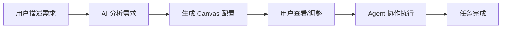

<div align="center">

# 🤖 OneCompany

**AI 驱动的多 Agent 协作开发框架**

[](https://github.com/zj-linjie/onecompany/stargazers)
[](https://github.com/zj-linjie/onecompany/blob/main/LICENSE)
[](https://www.typescriptlang.org/)
[](https://nodejs.org/)

[English](./README.md) | [简体中文](./README_CN.md)

**让 AI Agents 像团队一样协作开发**

</div>

---

## ✨ 特性亮点

<table>
<tr>
<td width="50%">

### 🎨 可视化配置
- **Canvas Skill Manager** - 拖拽式配置界面
- 直观的 Skills 和 Agents 管理
- 实时预览项目架构
- 支持模板快速初始化

</td>
<td width="50%">

### 🤖 AI 智能配置
- **AI 自动推荐** - 根据需求生成配置
- 智能技能匹配
- 自动补充相关配置
- **30 秒完成项目配置**

</td>
</tr>
<tr>
<td width="50%">

### ⚡ CLI 快速操作
- 命令行快速配置
- 支持脚本化操作
- 模板初始化
- 配置查看和管理

</td>
<td width="50%">

### 🔄 Multi-Agent 协作
- 自动任务分解
- 智能任务分配
- 并行执行
- 实时状态追踪

</td>
</tr>
</table>

---

## 🚀 快速开始

### 安装

```bash
# 克隆仓库
git clone https://github.com/zj-linjie/onecompany.git
cd onecompany

# 安装依赖
npm install

# 构建项目
npm run build
```

### 三种配置方式

#### 🤖 方式 1：AI 智能配置（最快 - 30秒）

```bash
cd workspaces/your-project
npm run canvas-ai
```

**示例对话**：
```
请描述你的项目需求:
> 开发一个电商网站，需要用户登录、商品管理、购物车功能

🔍 正在分析需求...

✅ 配置完成！

🔧 Skills (6 个):
  ✓ React 开发
  ✓ API 开发
  ✓ 数据库设计
  ✓ 身份认证
  ✓ Docker
  ✓ 单元测试

👥 Agents (4 个):
  ✓ 前端开发工程师
  ✓ 后端开发工程师
  ✓ DevOps 工程师
  ✓ 测试工程师
```

#### ⚡ 方式 2：CLI 快速配置

```bash
# 从模板初始化
npm run canvas-config init fullstack

# 查看配置
npm run canvas-config list

# 添加 Skill/Agent
npm run canvas-config add-skill react-dev
npm run canvas-config add-agent frontend-dev
```

#### 🎨 方式 3：Canvas 可视化配置

```bash
cd packages/canvas-app
npm run dev
```

在浏览器中打开，拖拽配置 Skills 和 Agents。

### 运行 Agent 协作模式

```bash
npm run onecompany
# 选择 "4. Agent 协作模式"
```

**示例输出**：
```
🤖 === Agent 协作模式 ===

请描述你的需求: 实现用户注册和登录功能

📋 正在分解任务...

✅ 成功分解为 4 个任务：

1. [architecture] 设计用户认证 API 接口
   状态: ready | 优先级: 10
2. [backend] 实现用户注册逻辑
   状态: pending | 优先级: 9 (依赖: 1 个任务)
3. [backend] 实现用户登录逻辑
   状态: pending | 优先级: 9 (依赖: 1 个任务)
4. [testing] 编写集成测试
   状态: pending | 优先级: 7 (依赖: 2 个任务)

🚀 开始执行任务...

[Orchestrator] Progress: 1/4 completed, 2 running, 0 failed
[Orchestrator] Progress: 3/4 completed, 1 running, 0 failed
[Orchestrator] Progress: 4/4 completed, 0 running, 0 failed

✅ 执行完成！
```

---

## 📖 核心概念

### 🎯 工作流程



### 🔧 Skills（技能）

项目所需的技术能力：

| 类别 | Skills |
|------|--------|
| **Frontend** | React 开发、Vue 开发、UI/UX 设计、状态管理 |
| **Backend** | API 开发、数据库设计、身份认证、GraphQL |
| **DevOps** | Docker、CI/CD |
| **Testing** | 单元测试、集成测试、E2E 测试 |

### 👥 Agents（智能体）

专业化的 AI 开发者：

| Agent | 专长 | 默认技能 |
|-------|------|----------|
| **前端开发工程师** | React 和 UI/UX 专家 | react-dev, ui-design, state-management |
| **后端开发工程师** | API 和数据库专家 | api-development, database-design, authentication |
| **全栈开发工程师** | 端到端开发 | api-development, react-dev, database-design |
| **DevOps 工程师** | CI/CD 和基础设施 | docker, ci-cd |
| **测试工程师** | 质量保证专家 | unit-testing, integration-testing, e2e-testing |

### 📋 Canvas 配置

可视化的项目配置文件（`.onecompany/canvas-config.json`）：

```json
{
  "version": "1.0.0",
  "nodes": [
    {
      "type": "skill",
      "skillId": "react-dev",
      "name": "React 开发",
      "enabled": true
    },
    {
      "type": "agent",
      "role": "frontend-dev",
      "name": "前端开发工程师",
      "skills": ["react-dev", "ui-design"],
      "enabled": true
    }
  ]
}
```

---

## 📦 项目结构

```
onecompany/
├── apps/
│   ├── cli/                    # OneCompany CLI 主程序
│   └── canvas-config-cli/      # Canvas 配置 CLI 工具
│       ├── index.mjs          # 快速配置命令
│       └── ai-suggest.mjs     # AI 智能配置
├── packages/
│   ├── core/                   # 核心逻辑
│   │   ├── orchestrator.ts    # 任务编排器
│   │   ├── task-queue.ts      # 任务队列
│   │   ├── task-scheduler.ts  # 任务调度器
│   │   └── agent-manager.ts   # Agent 管理器
│   ├── canvas-app/            # Canvas Skill Manager
│   │   ├── src/
│   │   │   ├── components/   # React 组件
│   │   │   ├── store/        # Zustand 状态管理
│   │   │   └── data/         # Skills 和 Agents 数据
│   │   └── package.json
│   ├── flow-new-project/      # 新建项目流程
│   ├── flow-takeover/         # 接管项目流程
│   ├── flow-iterate/          # 迭代开发流程
│   └── skills-catalog/        # 技能目录
├── workspaces/                # 示例项目
│   └── <project>/
│       ├── docs/             # 项目文档
│       └── .onecompany/      # Agent 状态和配置
└── docs/                      # 框架文档
```

---

## 🛠️ 技术栈

<div align="center">

| 层级 | 技术 |
|------|------|
| **核心框架** | TypeScript, Node.js, Monorepo |
| **Canvas 应用** | React 18, Vite, React Flow, Zustand, Tailwind CSS |
| **CLI 工具** | Commander.js, Inquirer.js, Chalk |
| **状态管理** | Zustand, localStorage |
| **可视化** | React Flow, Mermaid |

</div>

---

## 🎨 Canvas Skill Manager

<div align="center">

### 可视化配置界面

```
┌─────────────────────────────────────────────────────────────┐
│  Canvas Skill Manager                                       │
├─────────────┬───────────────────────────┬───────────────────┤
│             │                           │                   │
│  Skills     │      Canvas 画布          │   Agents         │
│  Catalog    │                           │   Library        │
│             │   ┌─────────┐             │                   │
│  □ React    │   │ Project │             │  □ Frontend Dev  │
│  □ API      │   └────┬────┘             │  □ Backend Dev   │
│  □ Database │        │                  │  □ DevOps        │
│  □ Testing  │   ┌────┴────┐             │  □ Tester        │
│             │   │  Skill  │             │                   │
│             │   └─────────┘             │                   │
│             │                           │                   │
└─────────────┴───────────────────────────┴───────────────────┘
```

</div>

### 功能特性

- ✅ **拖拽添加** - 从侧边栏拖拽 Skills 和 Agents 到画布
- ✅ **实时预览** - 即时查看项目架构
- ✅ **连接管理** - 可视化 Skills 和 Agents 的关系
- ✅ **模板系统** - 快速加载预设模板（全栈、前端、后端、移动端）
- ✅ **项目切换** - 管理多个项目配置
- ✅ **配置导出** - 保存配置到项目
- ✅ **键盘快捷键** - Delete 删除节点，Ctrl+Z 撤销（开发中）

---

## 🤖 AI 智能配置

### 工作原理

```
用户需求 → 关键词分析 → 技能匹配 → 智能推荐 → 自动补充 → 生成配置
```

### 智能推荐规则

- **前端关键词** → 推荐 React/Vue + UI 设计 + 前端工程师
- **后端关键词** → 推荐 API + 数据库 + 后端工程师
- **登录/认证** → 自动添加身份认证
- **前端 + 后端** → 自动推荐 DevOps
- **任何开发** → 自动推荐测试

### 示例

<table>
<tr>
<th>需求描述</th>
<th>AI 推荐</th>
</tr>
<tr>
<td>开发一个博客网站</td>
<td>React, API, 数据库, 前端工程师, 后端工程师, DevOps</td>
</tr>
<tr>
<td>做一个移动端 App</td>
<td>React, 响应式布局, UI 设计, 前端工程师, 设计师</td>
</tr>
<tr>
<td>构建 RESTful API</td>
<td>API 开发, 数据库, 认证, 后端工程师, DevOps, 测试</td>
</tr>
<tr>
<td>全栈电商平台</td>
<td>所有 Skills, 所有 Agents</td>
</tr>
</table>

---

## 📊 性能对比

<div align="center">

| 配置方式 | 时间 | 效率 | 适用场景 |
|---------|------|------|----------|
| **AI 智能配置** | 30 秒 | ⚡⚡⚡ | 新项目初始化 |
| **CLI 快速配置** | 2 分钟 | ⚡⚡ | 快速调整、脚本化 |
| **Canvas GUI** | 5-10 分钟 | ⚡ | 复杂配置、可视化展示 |
| **传统手动配置** | 30+ 分钟 | - | - |

**效率提升：10-20 倍！** 🚀

</div>

---

## 🔧 CLI 命令参考

### OneCompany CLI

```bash
npm run onecompany
```

**功能菜单**：
1. 新建项目
2. 接管旧项目（本地目录）
3. 继续迭代（传统模式）
4. **Agent 协作模式** 🤖
5. **Canvas 配置管理** 🎨
6. 退出

### Canvas 配置 CLI

```bash
# 查看配置
npm run canvas-config list

# 添加 Skill
npm run canvas-config add-skill <skill-id>
# 示例: npm run canvas-config add-skill react-dev

# 添加 Agent
npm run canvas-config add-agent <agent-role>
# 示例: npm run canvas-config add-agent frontend-dev

# 从模板初始化
npm run canvas-config init <template>
# 可用模板: fullstack, frontend, backend

# 启用/禁用节点
npm run canvas-config enable <node-id>
npm run canvas-config disable <node-id>

# 删除节点
npm run canvas-config remove <node-id>
```

### AI 智能配置

```bash
npm run canvas-ai
```

---

## 🌟 使用场景

### 场景 1：快速原型开发

```bash
# 1. AI 生成配置（30秒）
cd workspaces/my-blog
npm run canvas-ai
# 输入：开发一个个人博客系统

# 2. 开始开发
cd ../..
npm run onecompany
# 选择 "4. Agent 协作模式"
```

### 场景 2：团队协作

**架构师**：
```bash
# 1. 配置项目
npm run canvas-ai

# 2. 提交配置
git add .onecompany/canvas-config.json
git commit -m "feat: add canvas configuration"
git push
```

**团队成员**：
```bash
# 1. 拉取配置
git pull

# 2. 查看配置
npm run canvas-config list

# 3. 使用配置开发
npm run onecompany
# 选择 "4. Agent 协作模式"
```

### 场景 3：项目迁移

```bash
# 1. 接管现有项目
npm run onecompany
# 选择 "2. 接管旧项目"

# 2. AI 配置技术栈
cd workspaces/migrated-project
npm run canvas-ai

# 3. 开始重构
cd ../..
npm run onecompany
# 选择 "4. Agent 协作模式"
```

---

## 📚 文档

- 📖 [快速开始指南](./CANVAS_CLI_QUICK_START.md)
- 🎨 [Canvas 集成文档](./CANVAS_INTEGRATION.md)
- ⚡ [CLI 集成指南](./CANVAS_CLI_INTEGRATION.md)
- 🤖 [AI Agent 使用指南](./AI_AGENT_CANVAS_GUIDE.md)
- 📘 [使用手册](./USAGE_GUIDE.md)

---

## 🎯 Roadmap

### v0.2.0 ✅ (Current)
- ✅ Multi-Agent 协作框架
- ✅ Canvas Skill Manager
- ✅ AI 智能配置
- ✅ CLI 快速配置
- ✅ 任务自动分解和执行

### v0.3.0 🚧 (Next)
- [ ] 两阶段审查系统（Spec + Code review）
- [ ] 真实 Task tool 集成
- [ ] Web UI 监控面板
- [ ] 自定义 Agent 定义

### v0.4.0 📅 (Future)
- [ ] Agent 性能分析
- [ ] 从执行历史学习
- [ ] 多项目编排
- [ ] 远程 Agent 执行

---

## 🤝 贡献

欢迎贡献！请查看 [贡献指南](./CONTRIBUTING.md)。

### 开发设置

```bash
# 克隆仓库
git clone https://github.com/zj-linjie/onecompany.git
cd onecompany

# 安装依赖
npm install

# 构建所有包
npm run build

# 运行测试
cd packages/core
npm test

# 运行 CLI
npm run onecompany

# 启动 Canvas 应用
cd packages/canvas-app
npm run dev
```

### 提交规范

使用 [Conventional Commits](https://www.conventionalcommits.org/)：

```
feat: 添加新功能
fix: 修复 bug
docs: 更新文档
style: 代码格式调整
refactor: 重构代码
test: 添加测试
chore: 构建/工具链更新
```

---

## 🧪 测试

```bash
cd packages/core
npm test
```

**所有 63 个测试通过！** ✅

---

## 📄 许可证

[MIT License](./LICENSE)

---

## 🙏 致谢

- [React Flow](https://reactflow.dev/) - 可视化画布
- [Zustand](https://github.com/pmndrs/zustand) - 状态管理
- [Tailwind CSS](https://tailwindcss.com/) - 样式框架
- [Vite](https://vitejs.dev/) - 构建工具
- [TypeScript](https://www.typescriptlang.org/) - 类型系统

---

## 📮 联系方式

- **GitHub**: [@zj-linjie](https://github.com/zj-linjie)
- **Issues**: [GitHub Issues](https://github.com/zj-linjie/onecompany/issues)
- **Discussions**: [GitHub Discussions](https://github.com/zj-linjie/onecompany/discussions)

---

<div align="center">

### ⭐ 如果这个项目对你有帮助，请给一个 Star！

**让 AI Agents 像团队一样协作开发**

Made with ❤️ by [zj-linjie](https://github.com/zj-linjie)

</div>
